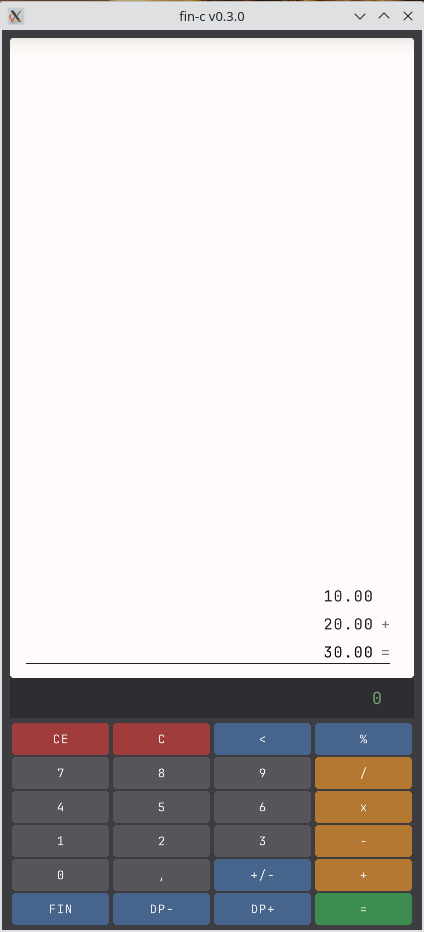
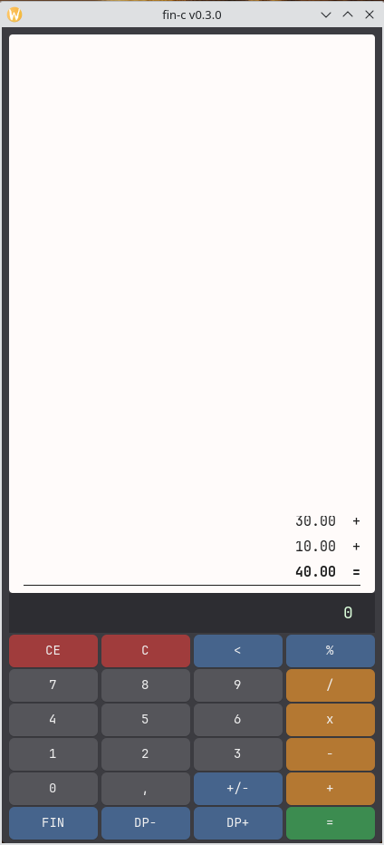

# fin-c

Calculadora financeira com visual de bobina de papel, feita em Zig. Dois frontends: GTK 4 (Linux/macOS) e raylib (Linux/macOS/Windows).

<p align="center">
  &nbsp;&nbsp;&nbsp;
  
</p>
<p align="center"><em>GTK 4 (esquerda) &nbsp;|&nbsp; raylib (direita)</em></p>

Written with assistance from Claude Code

## Build e execução

### GTK 4 (padrão)
```sh
zig build run
```
```sh
zig build -Doptimize=ReleaseSmall
```
Requer GTK 4 instalado no sistema (`gtk4` no pacman/apt).

### Raylib (opcional)
```sh
zig build -Dgui=raylib run
```
```sh
zig build -Dgui=raylib -Doptimize=ReleaseSmall
```
Raylib é compilado automaticamente como dependência (não precisa instalar no sistema).

Requer Zig 0.15.2.

## Arquitetura

- `src/main_gtk.zig` — frontend GTK 4 via `@cImport`. Tape como `GtkBox` scrollável, teclado como `GtkGrid` de `GtkButton`, input como `GtkLabel`. CSS para styling.
- `src/main.zig` — frontend raylib. Loop principal, renderização, input handling. Todo código que toca raylib fica aqui (Zig 0.15 não permite compartilhar tipos de `@cImport` entre módulos).
- `src/number.zig` — tipo `Decimal` com aritmética de ponto fixo baseada em `i128` (38 dígitos). Evita erros de float em cálculos contábeis. Formatação com separador de milhar (vírgula) e ponto decimal.
- `src/calc.zig` — engine de cálculo com modelo acumulador (como calculadora de mesa real). Operações: add, sub, mul, div, percent. Registradores financeiros (PV, FV, n, i, PMT) com resolução automática.
- `src/keyboard.zig` — layout do teclado virtual (6x4 grid). Dados puros, sem dependência de raylib. Layout alternativo no modo FIN.
- `src/tape.zig` — estrutura da bobina de papel (histórico de operações com scroll).

## Formato numérico

- Separador de milhar: vírgula (1,000,000)
- Separador decimal: ponto (0.50)
- Ctrl+V detecta automaticamente o formato (BR/EU `1.000,50` ou US `1,000.50`) e normaliza.

## Estado atual

### Implementado
- Dois frontends: GTK 4 (principal, `-Dgui=gtk`) e raylib (padrão)
- Janela redimensionável (420x900 padrão)
- Visor de bobina de papel maximizado (teclado compacto), scroll via mouse wheel
- Teclado virtual clicável (CE, C, backspace, %, dígitos, operadores, =, +/-, FIN, DP+/DP-)
- Teclado físico (numpad + teclas comuns)
- Aritmética com i128 fixed-point (casas decimais configuráveis 0-8, padrão 2)
- Formatação com separadores de milhar
- Suporte a valores enormes (até 38 dígitos)
- Operadores exibidos à direita dos valores na tape
- Font monospace customizada (JetBrains Mono, embutida no binário via `@embedFile`)
- Feedback visual de botão pressionado (mouse e teclado físico)
- Clipboard: Ctrl+V (paste com detecção automática de formato BR/EU vs US) e Ctrl+C (copy)
- Modo financeiro (botão FIN alterna layout):
  - Registradores: PV, FV, n, i, PMT
  - Cálculo automático quando 4 de 5 registradores estão preenchidos
  - Fórmulas: juros compostos, valor presente, anuidade, número de períodos, taxa (Newton-Raphson)
  - Markup (preço = custo / (1 - margem/100))

## Decisões de design

- **i128 fixed-point em vez de f64**: exatidão decimal para operações contábeis. Funções financeiras que precisam de pow/ln convertem para f64 temporariamente.
- **Modelo acumulador, não árvore de expressão**: calculadora financeira de mesa funciona sequencialmente.
- **Todo código de UI em main.zig / main_gtk.zig**: restrição do Zig 0.15 — `@cImport` em módulos diferentes gera tipos incompatíveis. Módulos de lógica (calc, number, tape, keyboard) são compartilhados.
- **ArrayList para tape**: cresce indefinidamente, memória trivial para uma sessão de calculadora.


## Comparação entre frontends: raylib vs GTK 4

### Volume de código

| | raylib (`main.zig`) | GTK 4 (`main_gtk.zig`) |
|---|---|---|
| Linhas | 497 | 511 |
| Funções de renderização | 5 (drawTape, drawInput, drawKeyboard, btnColor, drawText) | 3 (refreshDisplay, refreshTape, refreshButtons) |
| Helpers de cor | 2 (brighten, darken) | 0 (CSS cuida disso) |
| Mapeamento de teclado | 1 (handlePhysicalKey) | 1 (mapKey) |
| processAction | 132 linhas | 132 linhas (duplicada) |
| Estilo visual | ~15 constantes de cor no código | ~25 linhas de CSS inline |

Volume praticamente idêntico.

### Dificuldade de implementação

**Raylib é mais direto:**
- API imperativa: "desenhe retângulo aqui, texto ali"
- Sem callbacks — tudo num loop `while` síncrono
- Sem GObject, sem casts entre tipos opacos

**GTK exige mais cuidado em:**
- **Callbacks C** — Zig não resolve macros como `G_CALLBACK`; exige `g_signal_connect_data` com `@ptrCast`
- **Assinaturas de callback** — cada sinal GTK tem assinatura diferente; Zig é implacável com tipos opcionais (`?*` vs `*`)
- **Clipboard assíncrono** — raylib tem `GetClipboardText()` síncrono; GTK 4 exige `read_text_async` + callback
- **Layout declarativo** — `vexpand`, `halign`, CSS interagem de forma não-óbvia (ex: proporção 50/50 inesperada)

**Raylib exige mais cuidado em:**
- Scissor mode para clipping da tape
- Cálculo manual de layout (posição X/Y, hit-testing de botões)
- Feedback visual (timer de frames para efeito de botão)
- Font rendering (carregar TTF da memória, filtro bilinear)

### Conclusão

Para uma calculadora, raylib é mais direto — controle total de cada pixel. GTK compensa em projetos maiores onde widgets nativos (file dialogs, menus, acessibilidade, HiDPI, temas do sistema) justificam a complexidade do GObject. O fato de os módulos de lógica não terem sido tocados valida a arquitetura de manter todo código de UI isolado num único arquivo. GTK integra melhor no desktop dos contadores (copiar/colar nativo, tema do sistema, decorações consistentes).

## TODO

### Migração para GTK 4
- [x] Criar `src/main_gtk.zig` — frontend GTK 4 via `@cImport`
- [x] Adaptar `build.zig` com target `gui` (GTK) e `tui` (raylib)
- [x] Manter módulos de lógica inalterados: `calc.zig`, `number.zig`, `tape.zig`, `keyboard.zig`
- [x] Tape como `GtkBox` scrollável dentro de `GtkScrolledWindow`
- [x] Teclado virtual como `GtkGrid` de `GtkButton`
- [x] Input line como `GtkLabel` (read-only, alinhado à direita)
- [x] Suporte a teclado físico (mesmos atalhos da versão raylib)
- [x] Clipboard (Ctrl+C / Ctrl+V) via GTK
- [x] Modo financeiro (FIN toggle, registros PV/FV/n/i/PMT, markup)
- [x] Prioridade: GTK é o frontend principal (para os contadores)


